# System Architecture

## Overview

The JDR (Jeu de Rôle) project is a web-based role-playing game engine powered by an LLM (Large Language Model). It combines a Vue.js frontend with a FastAPI backend to deliver an interactive narrative experience.

## Core Components

### 1. Frontend (Vue.js)

- **GameView**: Main interface handling the chat, character sheet, and game state display.
- **Services**: `api.ts` handles communication with the backend via HTTP and SSE (Server-Sent Events).
- **State Management**: Uses Pinia (`gameData` store) to centralize game data (skills, stats, equipment, translations) and UI state.

### 2. Backend (FastAPI)

- **Routers**:
  - `gamesession.py`: Manages the game loop and LLM interaction.
  - `characters.py`: Handles character creation and retrieval.
- **Services**:
  - `GameFlowService`: Orchestrates the game logic.
  - `NarrativeAgent`: The "Game Master" AI that drives the story.
  - `ToolService`: Provides tools for the LLM to interact with the game state (dice rolls, inventory, etc.).
  - `TranslationService`: Manages dynamic translations for game terms.
- **Data Managers**:
  - `SkillsManager`, `RacesManager`, `EquipmentManager`: Load static game data from YAML files.
  - `ScenarioService`: Parses scenario files (Markdown + YAML frontmatter) to extract metadata (ID, Title) and content.

## LLM Decision Process

## Logic-First Decision Process

The system uses a **Logic-First** architecture. The decision-making process is separated from the narrative generation to ensure mechanical consistency.

```mermaid
sequenceDiagram
    participant User
    participant AgentRunner (Orchestrator)
    participant LogicOracle (Analyzer)
    participant ToolService
    participant NarrativeAgent (Storyteller)

    User->>AgentRunner: Sends Action ("I attack the goblin")
    
    rect rgb(20, 20, 20)
        note right of AgentRunner: Phase 1: Logic Resolution
        AgentRunner->>LogicOracle: Resolve Turn (Input + Context)
        LogicOracle->>ToolService: Execute Mechanics (Attack, Damage)
        ToolService-->>LogicOracle: Return Results ("Hit: 8 dmg")
        LogicOracle-->>AgentRunner: Returns System Logs & Context
    end

    AgentRunner-->>User: Streams System Logs (Dice, HP updates)

    rect rgb(30, 30, 50)
        note right of AgentRunner: Phase 2: Narrative Generation
        AgentRunner->>NarrativeAgent: Prompts with [SYSTEM REALITY]
        note right of NarrativeAgent: "Player hit goblin for 8 dmg."
        NarrativeAgent-->>AgentRunner: Streams Descriptive Text
    end

    AgentRunner-->>User: Streams Narrative ("Your blade strikes true...")
```

### How the Logic works

1. **Logic Oracle**: Analyzes the user's intent and maps it to specific game actions (Attack, Move, Use Item). It has access to all mechanical tools.
2. **System Reality**: The Oracle produces a "System Reality" block—a factual summary of what mechanically happened.
3. **Narrative Agent**: A purely descriptive agent. It receives the System Reality and translates it into immersive prose. It has **NO** tools and cannot change the game state.
4. **Consistency**: This ensures the narrative never hallucinates actions that didn't happen (e.g., describing a hit when the dice rolled a miss).

## Data Flow

1. **Static Data**: YAML files (`skills.yaml`, `races.yaml`) define rules. JSON files (`fr.json`) define translations.
2. **Dynamic Data**: User actions and tool results update the `GameState`.
3. **Persistence**: Game state is saved to JSON files/database between turns.
