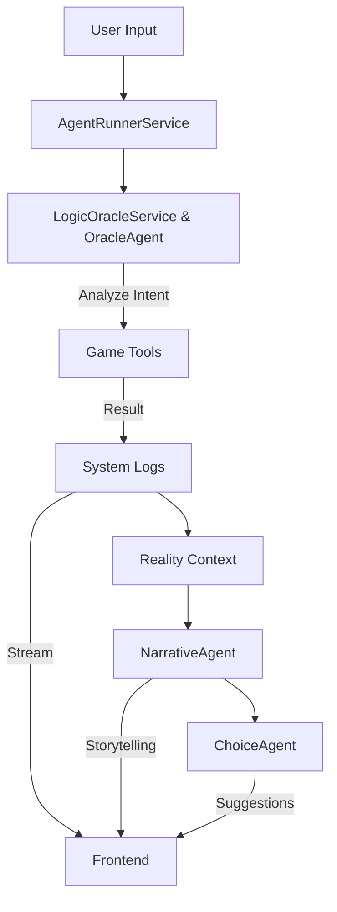
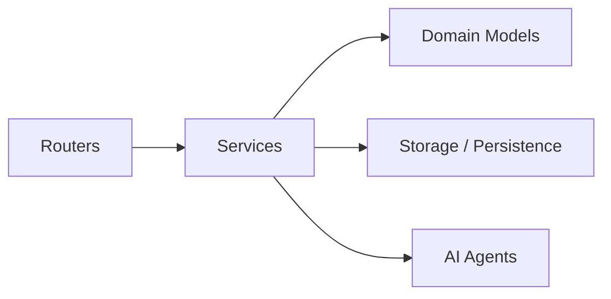

# FableStack - AI-Assisted RPG

Welcome to FableStack, an AI-driven backend role-playing game system designed to deliver an immersive and dynamic gaming experience.

## ⚡ Getting Started

### Prerequisites

- **Python**: 3.11 or higher
- **Node.js**: 18 or higher
- **Git**

### Installation

#### 1. Backend Setup

The backend handles the game logic, AI orchestration, and API.

```bash
# Navigate to the backend directory
cd back

# Create and activate a virtual environment
python -m venv venv
source venv/bin/activate  # On Windows: venv\\Scripts\\activate

# Install dependencies
pip install -r requirements.txt

# Start the development server
# Usage: ./run_dev.sh
./run_dev.sh
```

The API will be available at `http://localhost:8001`.

#### 2. Frontend Setup

The frontend provides the user interface for the game.

```bash
# Navigate to the frontend directory
cd front

# Install dependencies
npm install

# Start the development server
npm run dev
```

The application will be available at `http://localhost:5173`.

## 🚀 Project Status

The project is in active development. Key features include **User Authentication**, an **Admin Scenario Dashboard**, advanced character management, a turn-based combat system, and narration driven by AI agents.

## 🛠 Tech Stack

- **Language**: Python 3.11+
- **Framework**: FastAPI
- **AI**: PydanticAI, Pydantic Graph, Google Gemini
- **Data**: Pydantic V2, JSON (Persistence), YAML (Static Data)
- **Tools**: Poetry, Pytest, Ruff

## 🏗 Architecture

### Key Principles

- **Simplified Hexagonal Architecture**: Clear separation between the core domain (Domain), the application (Services), and the interfaces (Routers).
- **Agentic Workflow**: Uses state graphs to orchestrate interactions between the user and various specialized agents (Narrator, Combat Master).

### Multi-Agent Orchestration

The system uses a **"Logic-First"** approach, orchestrated by the `AgentRunnerService`. This ensures that narrative descriptions never contradict the mechanical reality of the game.



1. **Orchestrator (`AgentRunnerService`)**: The central hub that manages the entire lifecycle of a player's turn. It coordinates the Logic, Narrative, and Choice phases.
2. **The "Brain" (`LogicOracleService` & `OracleAgent`)**:
    - Analyzes the player's raw input (e.g., "I hit him with my sword").
    - Translates intent into mechanical actions using typed **Tools** (e.g., `combat_tools.attack`, `inventory_tools.use_item`).
    - Executes these tools to update the **Game State** (Domain Models).
    - Generates **System Logs** (Timeline events) that describe *what actually happened* (mechanically).
3. **The "Storyteller" (`NarrativeAgent`)**:
    - Receives the **Reality Context** (the aggregated facts from the Oracle phase).
    - Generates an immersive, atmospheric description of the events.
    - *Constraint*: It cannot change the facts (e.g., if the Oracle says an attack missed, the Narrator must describe a miss).
4. **The "Dungeon Master" (`ChoiceAgent`)**:
    - Analyzes the new situation.
    - Proposes 3 plausible actions for the player to take next (e.g., "Attack again", "Flee", "Drink Potion").

### Service Architecture



- **CharacterService**: Core character management (stats, progression).
- **EquipmentService**: Complete inventory and equipment management.
- **CombatService**: Combat resolution engine (initiative, attacks, damage). Combat state restoration and persistence.
- **GameFlowService**: Centralized game logic transitions (combat, death, scenario end).
- **TranslationService**: Dynamic translation management for the frontend.
- **SettingsService**: Global user preference management.
- **ImageGenerationService**: AI image generation for character portraits (via Runware).
- **GameSessionService**: Entry point for the main game loop.
- **LogicOracleService**: The deterministic brain. Analyzes player intent ("I attack the goblin") and executes mechanical tools (Combat, Inventory, Skills) BEFORE any narration.

### Streaming Architecture (Server-Sent Events)

The `/session/play-stream` endpoint uses SSE to provide a responsive, real-time experience:

1. **Logic Phase**: Instant feedback on mechanical actions (rolls, damage).
2. **Narrative Phase**: Token-by-token streaming of the description.
3. **Choice Phase**: Presentation of next options.

## 🎲 Game System

### Statistics

The system uses the 6 classic characteristics (Strength, Dexterity, Constitution, Intelligence, Wisdom, Charisma) to derive modifiers and skills.

### Combat

- **Initiative**: Based on Dexterity.
- **Actions**: Attack, Spell, Use Item.
- **Turn-based**: Managed by `CombatService` and the combat agent.
- **State**: Persistent via `CombatService`, allowing interrupted combat to be resumed.

### Skills & Difficulty

Skill checks now integrate a contextual difficulty notion:

- **Favorable** (-20 to threshold)
- **Normal** (0)
- **Unfavorable** (+20 to threshold)
The AI automatically determines the difficulty based on the narrative situation.

### Character Portraits

- **AI Generation**: Automatic portrait generation via **Runware** (Oil Painting Style).
- **Regenerate**: Users can request new portraits via the API.
- **Storage**: Local storage of generated images in `back/static/images`.

## 📂 Project Structure

```text
back/
├── agents/             # AI Agents (Narrative, Logic, Choice)
├── di.py               # Dependency Injection Container
├── app.py              # Application Factory
├── interfaces/         # Abstract Interfaces
├── models/             # Pydantic Models
│   ├── api/            # Pydantic models for API Requests/Responses
│   ├── domain/         # Core Domain Models (Character, Item) and Managers
│   └── ...
├── routers/            # FastAPI Endpoints (Game, Auth, User)
├── services/           # Business Logic (Combat, Equipment, AgentRunner...)
├── storage/            # Data Persistence Layer
├── tools/              # Typed Tools for AI Agents
├── utils/              # Utilities (Logger, Exceptions)
├── tests/              # Unit and Integration Tests
└── gamedata/           # Static Data (YAML) and Persistence (JSON)
    └── translations/   # Translation Files (JSON)
front/                  # Vue.js Frontend Application
    ├── src/
    │   ├── components/ # Reusable Vue components
    │   ├── views/      # Page definitions
    │   └── stores/     # Pinia State Stores
    └── ...
```

## 🔌 API Reference

### User

- `GET /user/preference`: Retrieve user preferences.
- `PUT /user/preference`: Update preferences.

### Translation

- `GET /translation/{language}`: Retrieve full translations.
- `PUT /translation/{language}`: Update a translation key.

### Auth

- `POST /auth/register`: Register a new user.
- `POST /auth/token`: Login (Get JWT Token).
- `POST /auth/forgot-password`: Request password reset.
- `POST /auth/reset-password`: Reset password with token.

### Admin (Users)

- `GET /users`: List all users (Admin only).
- `GET /users/{user_id}`: Get specific user details.

### Creation

- `POST /creation/validate-character`: Validate a complete character.
- `POST /creation/validate-character/by-id`: Validate an existing character.
- `GET /creation/races`: List playable races.

### Session

- `POST /session/play`: Send an action to the Game Master (complete response).
- `POST /session/play-stream`: Send an action with token-by-token streaming (SSE).
- `DELETE /api/gamesession/{session_id}`: Delete a game session and reset the character.

## 📝 Technical Specification

### Data Loading

Static data (Races, Classes, Equipment) is loaded from YAML files via Managers (`RacesManager`, `EquipmentManager`, `RulesManager`).

### Scenarios

Scenarios are defined in Markdown files with a YAML header (frontmatter) for metadata:

```markdown
---
id: "my_scenario"
title: "Scenario Title"  # Deprecated: Titles are now AI-generated
---

# Scenario Title

## Context
...
```

### Configuration

The project uses `pydantic-settings` to manage configuration.

- **`.env`**: Store secrets and environment-specific variables here.
- **`config.yaml`**: Store application-level defaults.

Example `.env`:

```bash
API_URL=http://localhost:8001
RUNWARE_API_KEY=your_key_here
```

### PydanticAI Tools

Agents interact with the world via typed tools defined in `back/tools/`.

- `combat_tools.py`: Combat tools (attack, end turn).
- `equipment_tools.py`: Inventory tools (buy, add, remove, decrement quantities).
- `character_tools.py`: Character tools (currency, damage, healing, XP).
- `skill_tools.py`: Skill tools (skill checks).

### Persistence

- **Characters**: JSON files in `gamedata/characters/`.
- **Combats**: JSON files in `gamedata/combat_states/`.
- **Preferences**: JSON file in `gamedata/settings/`.

## 💻 Installation and Development

See "Getting Started" above.

## 📝 License

This project is licensed under the PolyForm Noncommercial License 1.0.0. See the LICENSE file for details. For commercial inquiries, please contact <ben.marchand@free.fr>.
